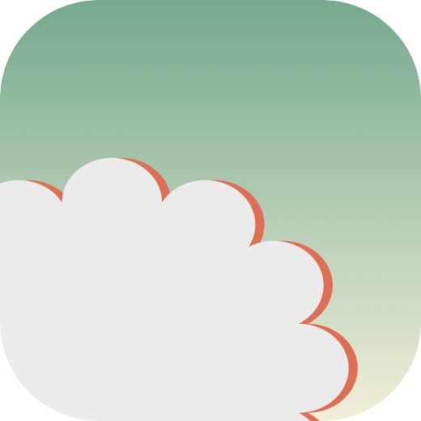

  

# Wellbeing App (currently unnamed)

A freeware and open source wellbeing app.

## Guiding Principles

This app is being developed, researched and released using the following guiding principles:

1. **Research-informed**: Wherever possible, any intervention or activity suggested by the app will be supported by academic research. An up-to-date list of academic references (APA style) will be kept within the app with a very brief description on what segment of the app it informed. A more detailed breakdown may appear on my private website, or here, at some point.
2. **Agile practises**: I will try to adopt agile coding practises as I go through. This means I aim to release useful features as soon as possible and reiterate, refactor and improve based on feedback. Using the in-app feedback button to let me know how things work for you is therefore the best way to gather this information at this stage.
3. **Cross-platform**: The app will (when a first release happens, see the [Features document for an overview](FEATURES.md)) be cross-platform, available initially for Windows, MacOS, Linux & iOS. Android may happen, I currently don't have any Android devices to play with.
4. **Free, Open Source**: Inspired by the likes of the NOBA project, the Linux community and countless other highly successful Free, Open Source Software (FOSS) projects out there, my aim is to offer a wide-ranging wellbeing tool available for free to anyone who seeks to use this. The only exception may be future iOS versions, due to the requirement for a paid Developer account with Apple. This will depend on any changes in my personal financial situation.

## Psychological Principles, Definitions and Criteria

Equally important are the psychological principles that guide decisions about what to include in this app. Since many concepts have varying definitions I will keep an overview here.

1. All activities and interventions available in the app will be *research-informed*. As explained by Ashman (2018), it is noted where evidence exists and where it does not, with decisions made accordingly. This approach acknowledges that, even where evidence exists, it may have other considerations, e.g. a very small number of participants or participants from a similar background or ethnicity.
2. There is no conclusive definition of *wellbeing*. For the purposes of this app, wellbeing is seen not as a state or fixed endpoint. Similar to work-life balance, it is seen as something we must always strive to maintain. A number of *self-care* interventions can assist with this balancing.
3. The concept of a psychologically rich life, as defined by Oishi & Westgate (2022) which states three related, but distinct aspects of a good life: happiness, meaning and psychological richness.

## Development Logs

My aim is to write a development log (or potentially record one on YouTube now and again) whenever I have something meaningful to say. These are hosted on my personal blog. Links to these dev logs are listed below, for easy reference.

- <a href="https://www.jaapmarsman.com/post/2022-08-10-devlog-one/" target="_blank">DevLog #1</a>

## Copyright, License & Attributions

Licensed under the [AGPL-3.0](LICENSE.md)

Copyright (c) 2022-present, [Jaap Marsman](https://www.jaapmarsman.com/)

For an overview of all underlying licences, copyrights and attributions, please see the [Copyrights document](COPYRIGHTS.md).

## References

Ashman, G. (2018). The truth about teaching: An evidence-informed guide for new teachers. SAGE.

Oishi, S., & Westgate, E. C. (2022). A psychologically rich life: Beyond happiness and meaning. Psychological Review, 129(4), 790–811. [https://doi.org/10.1037/rev0000317](https://doi.org/10.1037/rev0000317)